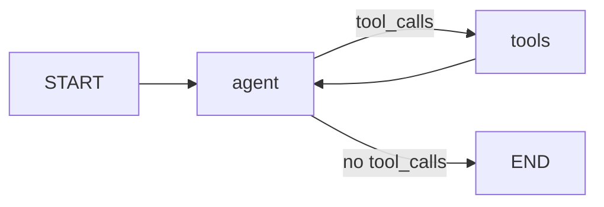

# Address book · LangGraph + OpenRouter

Sample project combining the [OpenRouter quickstart](https://openrouter.ai/docs/quickstart) with the [LangGraph Graph API quickstart](https://docs.langchain.com/oss/python/langgraph/quickstart): a **postal address book** driven by an explicit ReAct graph (agent → tools loop) and OpenRouter as the model backend.

Managed with **[uv](https://docs.astral.sh/uv/)** for installs, lockfile, and scripts.

## Requirements

- [uv](https://docs.astral.sh/uv/getting-started/installation/) 0.4+
- Python 3.11+ (pinned in `.python-version`; uv can install it)
- [OpenRouter API key](https://openrouter.ai/keys)

## Setup

```bash
# Install uv: https://docs.astral.sh/uv/getting-started/installation/

cd quickstart-openrouter
uv sync                    # create .venv + install from uv.lock

cp .env.example .env
# Set OPENROUTER_API_KEY in .env
```

`uv sync` reads `pyproject.toml` and `uv.lock` for reproducible installs. After changing dependencies, run `uv lock` then `uv sync`.

| Variable | Description |
|----------|-------------|
| `OPENROUTER_API_KEY` | Required |
| `OPENROUTER_MODEL` | Default `openrouter:anthropic/claude-haiku-4.5` (cheapest Anthropic compatible with strict ZDR) |
| `OPENROUTER_SITE_URL` | Optional attribution |
| `OPENROUTER_SITE_NAME` | Optional attribution |

## Usage

No need to activate `.venv` manually—use `uv run`:

### Address agent (main app)

```bash
uv run python main.py --demo
uv run python main.py "Search for addresses in San Francisco"

# or the console script from pyproject.toml
uv run addresses --demo
```

Thread memory uses LangGraph `InMemorySaver` and `--thread` (checkpoint id).

### Verify OpenRouter access

```bash
uv run python main.py --check
```

If you see **“No endpoints available matching your guardrail restrictions and data policy”**:

1. Open [OpenRouter privacy settings](https://openrouter.ai/settings/privacy).
2. Allow providers that match how you want data handled (strict ZDR-only mode blocks most routes).
3. Run `--check` again, then `--demo`.

This is an **account policy** issue on OpenRouter, not a bug in this repo.

With **ZDR enabled for Anthropic**, older Haiku models (`claude-3-haiku`, `claude-3.5-haiku`) usually have **no endpoint**. Use `anthropic/claude-haiku-4.5` (~$1/M input) or run `--check` for a suggested slug.

### Examples

```bash
uv run python examples/openrouter_direct.py
uv run python examples/langgraph_calculator.py
```

### Common uv commands

| Command | Purpose |
|---------|---------|
| `uv sync` | Install / update deps from lockfile |
| `uv lock` | Refresh `uv.lock` after editing `pyproject.toml` |
| `uv add <pkg>` | Add a runtime dependency |
| `uv add --dev <pkg>` | Add to `[dependency-groups] dev` |
| `uv run <cmd>` | Run in the project environment |
| `uv python pin 3.12` | Update `.python-version` |

## Architecture

```
addresses/
  models.py    # Address (Pydantic)
  store.py     # AddressStore (in-memory)
  tools.py     # @tool definitions
  state.py     # AgentState (TypedDict + message reducer)
  graph.py     # StateGraph: agent ↔ tools loop
  config.py    # env helpers
main.py        # CLI
examples/      # OpenRouter HTTP + LangGraph calculator
pyproject.toml # project + uv config
uv.lock        # locked dependency versions
```

### LangGraph flow



- **`agent` node**: `init_chat_model` + `bind_tools`, OpenRouter via `openrouter:` prefix.
- **`tools` node**: runs tool calls from the last AI message.
- **`should_continue`**: routes to `tools` or `END` (ReAct loop).
- **Checkpointer**: `InMemorySaver` for multi-turn threads.

## Agent tools

| Tool | Purpose |
|------|---------|
| `add_address` | Create entry |
| `list_addresses` | List with ids |
| `search_addresses` | Text search |
| `format_address` | Mailing format by id |
| `delete_address` | Remove by id |

## References

- [OpenRouter Quickstart](https://openrouter.ai/docs/quickstart)
- [LangGraph Quickstart (Graph API)](https://docs.langchain.com/oss/python/langgraph/quickstart)
- [uv docs](https://docs.astral.sh/uv/)
- [OpenRouter models](https://openrouter.ai/models)

## License

See [LICENSE](LICENSE).
